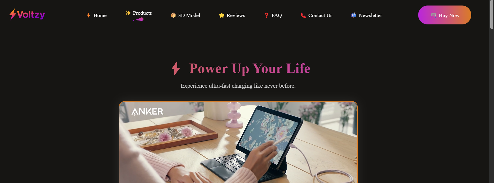

# ⚡ Power Bank Landing Page

A visually engaging and responsive landing page for a Power Bank product built using **React + Vite**. This project was created as part of an **intern assignment** to demonstrate skills in frontend development, UI/UX design, and creative presentation.

---

## 🚀 Features

- 🎥 Auto-playing product video hero section  
- 🖼️ High-resolution product showcase images  
- 💡 Creative layout for features and details  
- 🌀 3D model embedded via Sketchfab  
- 📱 Fully responsive across all screen sizes  
- ✨ Smooth scrolling navigation  
- 🎨 Modern design with gradients, hover effects, and clean fonts  
- 🛒 CTA buttons like “Buy Now” and “Know More”  

---

## 🔧 Tech Stack

- React (with Vite)  
- HTML5, CSS3, JavaScript  
- Sketchfab for 3D embedding  
- Google Fonts (Outfit)  

---

## 📸 Preview



---

## 💻 Getting Started

To run this project locally:

```bash
# Clone the repository
git clone https://github.com/Ayush-Chauhan17/PowerBank-Landing.git
cd PowerBank-Landing

# Install dependencies
npm install

# Start development server
npm run dev

